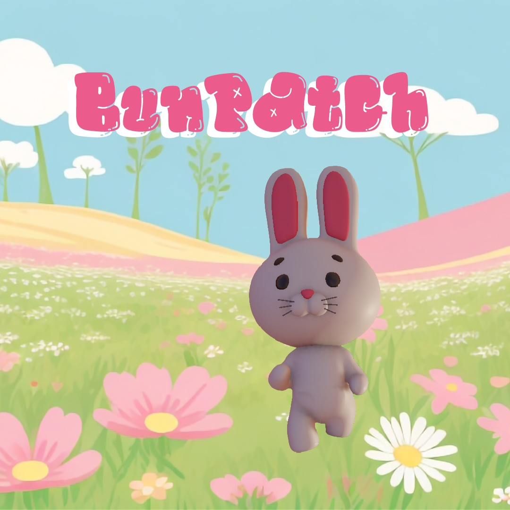

 

## 🐰 BunPatch

An accessible endless runner game developed in **Unity**, designed specifically for people with limited or no hand mobility. The game uses **voice commands** as the primary input method, allowing players to control the character without relying on traditional controllers, keyboards, or touch input.

---

## 📖 Overview

**Voice Bunny Runner** is an inclusive game where players control a rabbit that moves left and right across different lanes while collecting carrots and avoiding obstacles. The character's movement is controlled entirely through voice recognition, making the experience accessible to users with upper-limb motor disabilities.

The project was developed as an initiative to promote accessibility and demonstrate how voice-controlled mechanics can be integrated into video games to create more inclusive digital experiences.

---

## 🎮 Gameplay

* Control a rabbit using voice commands.
* Move between lanes to collect carrots.
* Use voice commands to control the interface.
* Avoid obstacles that appear along the path.
* Earn points by collecting carrots and surviving longer.
* Designed for hands-free interaction.
* The carrot and the time score.

---

## ♿ Accessibility Features

* Voice-controlled gameplay.
* No keyboard, mouse, or controller required.
* Designed for players with limited hand mobility.
* Simple and intuitive command system.
* Reduced physical interaction requirements.

---

## 🛠️ Technologies Used

* **Unity**
* **C#**
* **Unity Voice Recognition APIs**
* **Blender** (3D asset creation)
* **Visual Studio**

---


## 🚀 Installation

1. Clone the repository:

```bash
git clone https://github.com/yourusername/Voice-Bunny-Runner.git
```

2. Open the project using Unity Hub.

3. Select the appropriate Unity version.

4. Open the main scene.

5. Run the game.

---

## 🎯 Objectives

* Promote accessibility in video games.
* Explore voice recognition as an alternative input method.
* Provide an entertaining experience for players with motor disabilities.
* Raise awareness about inclusive game design.

---

## 👥 Target Audience

This game is intended for:

* Players with upper-limb mobility impairments.
* Rehabilitation and accessibility projects.
* Educational institutions researching inclusive technologies.
* Developers interested in accessible game design.

---

## 📸 Screenshots

Add screenshots of your game here.

```markdown

```

---

## 🔮 Future Improvements

* Additional voice commands.
* Difficulty levels.
* Multiple environments and characters.
* Enhanced speech recognition accuracy.
* Multi-language voice support.

---


## ❤️ Accessibility First

This project was created with the belief that video games should be enjoyable and accessible for everyone, regardless of physical limitations.
